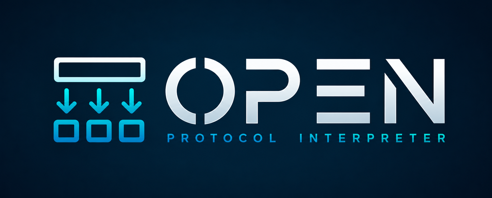

[](https://www.nuget.org/packages/OpenProtocolInterpreter)
[](https://www.nuget.org/packages/OpenProtocolInterpreter)
[](https://github.com/Rickedb/OpenProtocolInterpreter/actions/workflows/release.yml)
[](https://raw.githubusercontent.com/Rickedb/OpenProtocolIntepreter/master/LICENSE)
[](https://github.com/sponsors/rickedb)

> OpenProtocol communication utility

 1. [What is Open Protocol at all?](#what-is-open-protocol-at-all)
 2. [What is OpenProtocolInterpreter?](#what-is-openprotocolinterpreter)
 3. [Get it on NuGet](#get-it-on-nuget)
 4. [How does it work?](#how-does-it-work)
 5. [Usage examples](#lets-see-some-examples-of-usage)
    * [Parsing a package](#parsing-a-package)
    * [Packing a MID](#packing-a-mid)
    * [Replies and acknowledges](#replies-and-acknowledges)
 6. [Anatomy of a MID](#anatomy-of-a-mid)
    * [Data field attributes](#data-field-attributes)
    * [Available attributes](#available-attributes)
    * [Revisions](#revisions)
 7. [Advanced section](#advanced-section)
    * [MIDs identifying customization](#mids-identifying-customization)
    * [Extra data (MID 0006, 0008 and 0009)](#extra-data-mid-0006-0008-and-0009)
    * [MIDs overriding](#mids-overriding)
    * [Adding MIDs that are not in documentation](#adding-mids-that-are-not-in-documentation)
    * [How it was built?](#how-it-was-built)
    * [Advanced example](#advanced-example)
 8. [Tips](#tips)
 9. [Supported frameworks](#supported-frameworks)
10. [Contribute to the project](#contribute-to-the-project)
11. [Sponsor the project](#sponsor-the-project)
12. [Still unavailable mids](#list-of-still-unavailable-mids)


## What is Open Protocol at all?

Open Protocol, as the name says, it's a protocol to communicate with Atlas Copco Tightening Controllers or whatever that implement that protocol.
Most common Tightening Controllers from Atlas Copco company are **PowerFocus4000** and **PowerMacs**.

*Although, some other companies adhered to use the same protocol.*

## What is OpenProtocolInterpreter?

OpenProtocolInterpreter is a **library that converts the ugly string** that came from Open Protocol packages, which is commonly called **MID**, to an **object**.
*"Substringing"* packages is such a boring thing to do, so let OpenProtocolIntepreter do it for you!

**[If you're curious, just take a look at their documentation.](docs/OpenProtocol_Specification.pdf)**

## Get it on [NuGet](https://www.nuget.org/packages/OpenProtocolInterpreter)!
```
Install-Package OpenProtocolInterpreter
```

## How does it work?

It's simple, you give us your byte[] or string package and we deliver you an object, simple as that!

For example, let's imagine you received the following string package:
``` csharp
string package = "00240005001         0018";
```
It's **MID 5**, so OpenProtocolIntepreter will return a **Mid0005** class for you with all his datafields and the package entire translated to an object.

## Let's see some examples of usage

### Parsing a package

`MidInterpreter` starts empty: you must tell it which MIDs it should know about before parsing anything.
`UseAllMessages()` is the "give me everything" shortcut — see [MIDs identifying customization](#mids-identifying-customization) to narrow it down.

``` csharp
var interpreter = new MidInterpreter().UseAllMessages();

var midPackage = "00260004001         001802";
var myMid04 = interpreter.Parse<Mid0004>(midPackage);

//MID 0004 is an error mid which contains which MID failed and its error code
int myFailedMid = myMid04.FailedMid;    // 18
Error errorCode = myMid04.ErrorCode;    // Error.ParameterSetIdNotPresent
```

Everything a MID carries is a plain, settable property, so you can read it straight away.
`byte[]` packages are accepted by the very same overloads:

``` csharp
byte[] rawPackage = socket.Receive();
var mid = interpreter.Parse(rawPackage);        // returns Mid, use it when you don't know what is coming
var mid04 = interpreter.Parse<Mid0004>(rawPackage);
```

> Use `Parse(package)` when you don't know which MID will arrive and `Parse<DesiredMid>(package)` when you do.
> The generic overload throws `InvalidCastException` when the package turns out to be another MID.

### Packing a MID

It can generate an object from a string, but can it make it to the other way?? FOR SURE!

``` csharp
var jobUploadRequest = new Mid0032(revision: 2) { JobId = 1 };
var package = jobUploadRequest.Pack();
//Generated package => 00240032002         0001

var bytes = jobUploadRequest.PackBytes();       // same content, ASCII encoded
var terminated = jobUploadRequest.PackWithNul(); // appends the NUL character some controllers expect
```

The header length is recalculated for you on every `Pack()`, based on the revision in `Header.Revision`.
Every MID exposes a parameterless constructor (revision 1) and a `Mid(Header header)` constructor; the ones that
have more than one documented revision also expose `Mid(int revision)`.

### Replies and acknowledges

MIDs advertise their relationships through marker interfaces, so it might help you to remember which MID answers which or even give a shortcut for you:

``` csharp
Mid0062 ack = new Mid0061(2).GetAcknowledge();  // IAcknowledgeable<Mid0062>, keeps the source revision
Mid0033 reply = new Mid0032(2).GetReply();      // IAnswerableBy<Mid0033>
```

## Anatomy of a MID

### Data field attributes

A MID has **each property is decorated with a data field attribute** describing where that value lives inside the package. Which also represents the string index/position of the package accordingly with Open Protocol documentation. E.g.:

``` csharp
public class Mid0004 : Mid, ICommunication, IController
{
    public const int MID = 4;

    [Int32DataFieldDefinition(revision: 1, field: 1, Index = 20, Size = 4, HasPrefix = false)]
    [Int32DataFieldDefinition(revision: 2, field: 1, Index = 20, Size = 4, HasPrefix = false)]
    public int FailedMid { get; set; }

    [Int32DataFieldDefinition(revision: 1, field: 2, Index = 24, Size = 2, HasPrefix = false)]
    [Int32DataFieldDefinition(revision: 2, field: 2, Index = 24, Size = 3, HasPrefix = false)]
    public Error ErrorCode { get; set; }

    public Mid0004() : this(DEFAULT_REVISION) { }
    public Mid0004(Header header) : base(header) { }
    public Mid0004(int revision) : this(new Header { Mid = MID, Revision = revision }) { }
}
```

Every attribute accepts:

| Member | Meaning |
| - | - |
| `revision` | Revision this definition belongs to. |
| `field` | Data field id/sequence/index inside the revision. |
| `Index` | Offset of the value inside the package, counted from the start of the package (the header takes the first 20 chars). |
| `Size` | Length of the value. Fixed automatically by some attributes that has fixed size (booleans, timestamps). |
| `HasPrefix` | `true` when the package carries the two digit field id right before the value. |
| `PaddingChar` | Char used to pad the value to its full size when packing. |
| `PaddingOrientation` | Defines if char filling `RightPadded` or `LeftPadded` |

Parsing and packing both flow through the same definitions: on `Parse` the slice is read, converted and **written back into the property**; on `Pack` the property value is read, converted and written into the package.

### Available attributes

| Attribute | Property type | Notes |
| - | - | - |
| `BooleanDataFieldDefinition` | `bool` | `Size` forced to 1 |
| `StringDataFieldDefinition` | `string` | Defaultly right padded with `' '`|
| `Int32DataFieldDefinition` | `int`, `int`-backed `enum` | left padded with `'0'` |
| `Int64DataFieldDefinition` | `long`, `long`-backed `enum` | left padded with `'0'` |
| `DecimalDataFieldDefinition` | `decimal` | left padded with `'0'` |
| `TruncatedDecimalDataFieldDefinition` | `decimal` | `DecimalPoints` (default 2) implicit decimal places |
| `TimestampDataFieldDefinition` | `DateTime` | `Size` forced to 19, `YYYY-MM-DD:HH:MM:SS` |
| `Int32CollectionDefinition` | `List<int>` | requires `EachFieldSize` |
| `EnumCollectionDefinition<T>` | `List<T>` where `T : Enum` | one char per entry |
| `VariableDataFieldCollectionDefinition` | `List<VariableDataField>` | the variable data fields block |

### Revisions

At parse/pack time only the definitions up to `Header.StandardizedRevision` are used so we can avoid confusion with revision `0` since when zero or blank it represents revision `1`.

## Advanced Section!

Now we will get real!
Put one thing in mind, in real world we will always need to build something more complex than the dummies examples we give to you.
**With this in mind, this section is for you:**

#### MIDs Identifying Customization

We have several MIDs inside Open Protocol documentation, but do you really need all of them?
The answer is... **NO!**

You will probably need only to use a range of MIDs, with this in mind, we did something to make things faster. You can tell us which MIDs we should considerate!

Here is an example:
``` csharp
var myCustomInterpreter = new MidInterpreter()
                                .UseAllMessages(new Type[]
                                {
                                    typeof(Mid0001),
                                    typeof(Mid0002),
                                    typeof(Mid0003),
                                    typeof(Mid0004),
                                    typeof(Mid0106)
                                });

//Will work:
var myMid04 = myCustomInterpreter.Parse<Mid0004>("00260004001         001802");

//Won't work, will throw NotImplementedException, MID 0030 was never registered:
var unknown = myCustomInterpreter.Parse("00220030001         01");
```

You can also register a whole category at once, and filter it by your role in the communication:

``` csharp
var interpreter = new MidInterpreter()
                        .UseCommunicationMessages(InterpreterMode.Integrator)
                        .UseTighteningMessages(InterpreterMode.Integrator)
                        .UseAlarmMessages(InterpreterMode.Integrator);
```

`InterpreterMode.Integrator` keeps only the MIDs a controller can send you, `InterpreterMode.Controller` keeps
only the ones an integrator can send, and `InterpreterMode.Both` (the default) keeps everything.
There is one `Use...Messages` extension per category, all of them accepting a mode, an `IEnumerable<Type>` or an
`IDictionary<int, Type>` (see [MIDs overriding](#mids-overriding)).

#### Extra data (MID 0006, 0008 and 0009)

MIDs 0006 (request), 0008 (subscription) and 0009 (unsubscription) carry a free form payload whose layout
depends on the MID being requested/subscribed. Those payloads are modelled by `ExtraData` classes, which use the very same data field attributes as a MID:

``` csharp
var subscription = new Mid0008();
subscription.SetExtraData(new Mid1201ExtraDataSubscription
{
    SendAlternatives = 1,
    DataIdentifierTimestamp = new DateTime(2026, 8, 7, 13, 45, 0),
    SendObjectData = true
});

var package = subscription.Pack();
//Generated package => 00590008001         12010013000000000012026-08-07:13:45:001
```

`SetExtraData` fills `SubscriptionMid`, `WantedRevision`, `ExtraDataLength` and `ExtraData` for you.
On the receiving side, parse the container MID first and then hand its raw `ExtraData` to the matching class:

``` csharp
var mid08 = interpreter.Parse<Mid0008>(package);
var extraData = (Mid1201ExtraDataSubscription)new Mid1201ExtraDataSubscription(mid08.WantedRevision)
                                                    .Parse(mid08.ExtraData);

int alternatives = extraData.SendAlternatives;
DateTime timestamp = extraData.DataIdentifierTimestamp;
```

A MID may declare one `ExtraData` per kind, since request (`IExtraDataRequest`), subscription (`IExtraDataSubscription`) and unsubscription (`IExtraDataUnsubscription`) payloads don't necessarily share the same content.

> If necessary you can add `ExtraData` manually as plain string.

#### MIDs Overriding

Maybe you have a totally crazy controller that does not implement the Mid as the documentation says or you might want to inject your own Mid inheriting another Mid,
so you can customize it and add more properties to handle some conversions. Anyway, if you need that, it's possible to override!

Here is an example:
``` csharp
//This will override Mid 81 with my custom Mid
var interpreter = new MidInterpreter()
                        .UseAllMessages()
                        .UseTimeMessages(new Dictionary<int, Type> { { Mid0081.MID, typeof(OverridedMid0081) } });

var mid = interpreter.Parse("00390081001         2026-08-07:13:45:00");
//mid is an OverridedMid0081


public class OverridedMid0081 : Mid0081
{
    public string FormattedDate
    {
        get => Time.ToString("dd/MM/yyyy HH:mm:ss");
        set => Time = DateTime.Parse(value);
    }

    public OverridedMid0081()
    {

    }
}
```

> Your type must expose a parameterless constructor — that's the one the interpreter compiles and calls.

#### Adding MIDs that are not in documentation

Maybe your controller is weird and have unknown MID numbers, MIDs that are not in the documentation and you want to inject into MidInterpreter, there is a way:

``` csharp
var interpreter = new MidInterpreter()
                        .UseAllMessages()
                        .UseCustomMessage(new Dictionary<int, Type> { { NewMid0083.MID, typeof(NewMid0083) } });

public class NewMid0083 : Mid
{
    public const int MID = 83;

    [TimestampDataFieldDefinition(revision: 1, field: 1, Index = 20, HasPrefix = false)]
    public DateTime Time { get; set; }

    [StringDataFieldDefinition(revision: 1, field: 2, Index = 39, Size = 2, HasPrefix = false)]
    public string TimeZone { get; set; }

    public NewMid0083() : base(MID, DEFAULT_REVISION)
    {

    }

    public NewMid0083(Header header) : base(header)
    {

    }
}

//new NewMid0083 { Time = new DateTime(2026, 8, 7, 13, 45, 0), TimeZone = "BR" }.Pack()
//  => 00410083001         2026-08-07:13:45:00BR
```

> **NOTE:** Custom messages might not perform as fast as other MIDs because they don't have optimizations for finding it

#### Advanced Example

Declared a delegate:

``` csharp
protected delegate void ReceivedCommandActionDelegate(ReceivedMidEventArgs e);
```
**ReceivedMidEventArgs class**:
``` csharp
public class ReceivedMidEventArgs : EventArgs
{
    public Mid ReceivedMid { get; set; }
}
```
Created a method to register all those MID types by delegates:

``` csharp
protected Dictionary<Type, ReceivedCommandActionDelegate> RegisterOnAsyncReceivedMids()
{
    var receivedMids = new Dictionary<Type, ReceivedCommandActionDelegate>();
    receivedMids.Add(typeof(Mid0005), new ReceivedCommandActionDelegate(OnCommandAcceptedReceived));
    receivedMids.Add(typeof(Mid0004), new ReceivedCommandActionDelegate(OnErrorReceived));
    receivedMids.Add(typeof(Mid0071), new ReceivedCommandActionDelegate(OnAlarmReceived));
    receivedMids.Add(typeof(Mid0061), new ReceivedCommandActionDelegate(OnTighteningReceived));
    receivedMids.Add(typeof(Mid0035), new ReceivedCommandActionDelegate(OnJobInfoReceived));
    return receivedMids;
}
```
What was done is registering in a dictionary the correspondent delegate for a determinated MID, once done that we just need to invoke the delegate everytime you face a desired MID.

When a package income:

``` csharp
protected void OnPackageReceived(string message)
{
    try
    {
        //Parse to mid class
        var mid = Interpreter.Parse(message);

        //Get Registered delegate for the MID that was identified
        if (!OnReceivedMid.TryGetValue(mid.GetType(), out var action))
            return; //Stop if there is no delegate registered for the message that arrived

        action(new ReceivedMidEventArgs { ReceivedMid = mid }); //Call delegate
    }
    catch (Exception ex)
    {
        Console.WriteLine(ex.Message);
    }
}
```
This would call the registered delegate which you're sure what mid it is.
For example when a **MID_0061** (last tightening) pop up, the **OnTighteningReceived** delegate will be called:

``` csharp
protected void OnTighteningReceived(ReceivedMidEventArgs e)
{
    try
    {
        var tighteningMid = (Mid0061)e.ReceivedMid; //Casting to the right mid

        //This method just send the ack from tightening mid
        BuildAndSendAcknowledge(tighteningMid);
        Console.WriteLine("TIGHTENING ARRIVED");
    }
    catch (Exception ex)
    {
        Console.WriteLine(ex.Message);
    }
}

protected void BuildAndSendAcknowledge(Mid0061 mid)
{
    var ack = mid.GetAcknowledge(); //Mid0062, on the same revision as the received mid
    TcpClient.GetStream().Write(ack.PackBytes()); //Send acknowledge to controller
}
```

### Tips

> Instantiate the **MidInterpreter** class just once and keep working with it! Template lookups are cached per instance.

> **Controller Implementation Tip:** Always **TRY** to register used MIDs, not all Tightening Controllers use every available MID.

> **Integrator Implementation Tip:** Always **DO** register used MIDs, I'm pretty sure you won't need all of them to your application.

### Contribute to the project

Bug reports, controllers that behave differently from the specification and new MIDs are all very welcome.
Fork it, add your MID next to its category (with its tests in `src/MIDTesters.Core`) and open a pull request.
The [Still unavailable MIDs](#list-of-still-unavailable-mids) table below is a good place to pick something up.

### Sponsor the project

OpenProtocolInterpreter is built and maintained on free time, and the hardware it talks to isn't exactly the
kind of thing you keep on your desk. If this library saved you a few days of *"substringing"* packages — or if
your company ships something on top of it — consider sponsoring its development:

[](https://github.com/sponsors/rickedb)
[](https://www.buymeacoffee.com/rickedb)

* **[GitHub Sponsors](https://github.com/sponsors/rickedb)** — one-off or monthly, and it shows up right here on the repository.
* **[Buy me a coffee](https://www.buymeacoffee.com/rickedb)** — for a quick thank you.

Sponsoring keeps new MIDs, new specification revisions and bug fixes coming. Not in a position to sponsor?
Starring the repository, reporting a controller that misbehaves or sending a pull request helps just as much.

### List of still unavailable Mids

| MID | Description | Notes |
| - | - | - |
| 0007 | Reserved | Reserved by Atlas Copco |
| 0025 | Parameter user set download request | |
| 0049 | Pairing Status Acknowledge | |
| 0700 | Tightening data download status for radio tools | |
| 0900 | Result traces curve | |
| 0901 | Result traces curve plot data | |
| 1601 | Dynamic identifier message | |
| 1602 | Dynamic identifier data acknowledge | |
| 1900 | Selector socket info | |
| 1901 | Selector socket control | |
| 2100 | Device command | |
| 2500 | Program data download | |
| 2600 | Mode ID upload request | |
| 2601 | Mode ID upload reply | |
| 2602 | Mode data upload request | |
| 2603 | Mode data upload reply | |
| 2604 | Mode selected | |
| 2605 | Mode selected acknowledge | |
| 2606 | Select Mode | |
| 8000 | Audi emergency status subscribe | |
| 8001 | Audi emergency status | |
| 8002 | Audi emergency status acknowledge | |
| 8003 | Audi emergency status unsubscribe | |

Feel free to fork and contribute to add any of those mids.
